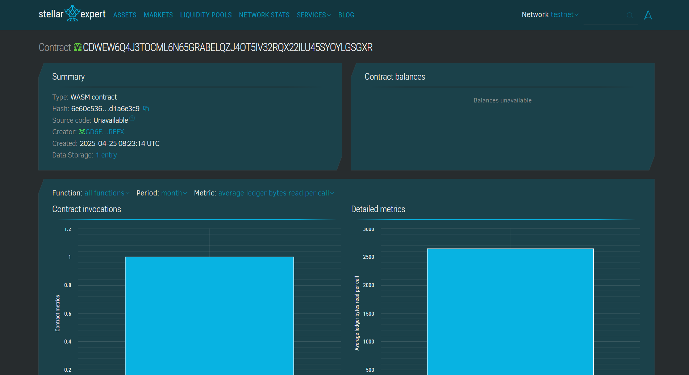

# Expense Tracker using Blockchain

## 📄 Project Description
A lightweight smart contract that helps users record, track, and retrieve their expense records in a transparent and immutable way using blockchain technology. This contract is built using Stellar's Soroban SDK.

## 🎯 Project Vision
To empower users with a decentralized, tamper-proof ledger that records personal or organizational expenses. The goal is to bring transparency, accountability, and permanence to everyday financial tracking using the power of blockchain.

## ✨ Key Features
- **Add Expense:** Log a new expense with a title, amount, and timestamp.
- **View Expense:** Retrieve a specific expense entry using its unique ID.
- **Total Count:** Keep track of how many expenses have been logged so far.
- **Immutable Logs:** All records are saved on-chain and cannot be tampered with.

## 🚀 Future Scope
- Add user authentication and wallet linking.
- Summarize expenses by categories (e.g., food, travel, utilities).
- Allow exporting expenses to a downloadable report (e.g., CSV or JSON).
- Integrate with mobile/web frontends for user-friendly interfaces.
- Implement expense limits and monthly budgets with alerts.

## contract build 
CDWEW6Q4J3TOCML6N65GRABELQZJ4OT5IV32RQX22ILU45SYOYLGSGXR
